# **Data Lovers - League of Legends**
## Team : Judith Milusca Vega ft Elizabeth Rivera 
___
## Índice
* [1. Preámbulo](#1-preámbulo)
* [2. Definición del producto](#2-definición-del-producto)
* [3. Investigación UX](#3-investigación-ux)

***
## 1. Preámbulo
League of Legends también conocido por sus siglas LoL es un videojuego muy popular, con millones de jugadores en todo el mundo. Su fama lo ha consolidado como uno de los _esports_ de referencia y que más público atraen. Sin embargo, hay mucha gente que no ha querido dar el paso de probarlo. 
League of Legends es un **MOBA** (multiplayer online battle arena) :woman_technologist: y deporte electrónico desarrollado por Riot Games , donde escogemos a un campeón con distintas habilidades para enfrentarnos a otro equipo. Cuenta con varios mapas o modos de juego, aunque el principal y el que se juega en competitivo es la _Grieta del Invocador_, donde lucha cinco contra cinco.
Las partidas de League of Legends podrían ser eternas, pero por lo general suelen rondar entre los 25 y los 40 minutos. El mapa está dividido por un enorme río que lo divide en dos, los mismos caminos en los dos. Cada equipo cuenta con una base, donde hay un Nexo. El objetivo de la partida es defender tu Nexo y destruir el del rival.

## 2. Definición del producto:
En este proyecto: **Data Lovers** seleccionamos el tema League of Leguends, es un videojuego online (**MOBA**). Nuestro objetivo fue construir una interfaz para visualizar datos que nuestros usuarios necesiten. 
Primero elegimos quienes serian nuestros ususarios, elaboramos entrevistas y encuestas para poder analizar las necesidades de los ususarios; luego realizamos prototipos de _baja_ y _alta_ fidelidad, para poder iterar con los usuarios y poder evaluar y priorizar los datos necesarios para solucionar sus necesidades. Construimos una interfaz :woman_technologist: que le va ayudar a interactuar y entender mejor esos datos. Nuestra página web permitirá visualizar los datos, tener un _top 5 de campeones_, _buscar_, _filtrar_ los datos de los campeones y _ordenarlos_.

## 3. Investigación UX :pencil:
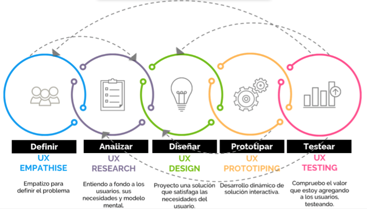

:shipit: :mag_right: Los usuarios a los que este proyecto va dirigido son aquellos jugadores de videojuegos (gamers) o personas que se inician en el mundo de "League of Legends" y quieren conocer más de los campeones. Nuestra interfaz permitirá visualizar la data, filtrarla, ordenarla.

## Organización del Trabajo (planificación): (icono calendario)
 Para realizar nuestra planificación utilizamos _JIRA_  en donde estructuramos bien las tareas para cada historias de usuario y en cuantos springs lo entregariamos.

 

## Entrevista y encuestas a usuarios:
Las entrevistas que realizamos a nuestros usuarios se realizo por discord.
 - Nos presentamos y explicamos de que trata la entrevista.
 - Tuvo una duración de 20 a 30 minutos.

**Preguntas** 
•	¿Cuéntanos a que te dedicas?
•	¿Qué haces en tus tiempos libres?
•	¿Cómo supiste de éste juego? 
•	¿Cuánto tiempo vas jugando LOL?
•	¿Qué es lo que más te llama la atención del juego?
•	¿Cuántas horas a la semana puedes llegar a jugar?
•	¿Qué tipo de partidas juegas más?
•	¿Perteneces a alguna o varias comunidades de LOL? ¿Cuáles? 
•	¿Te interesaría saber del lore de cada campeón o un top?
•	¿Tienes sitios web donde buscar información sobre LOL? ¿Cuáles son?
•	¿Qué es lo que más buscas en estos sitios web?

**Entrevistado:** Alfonzo Gutierrez
•	Edad: 18 años
•	ocupación: Estudiante
•	Medio de entrevista: Discord.
•	Evidencia: Grabación de entrevista.
Nuestro entrevistado es un jugador principiante de League of Legends, comenzó a jugarlo gracias a la publicidad de youtube y por algunos amigos. Durante la entrevista el usuario nos comento que existen muchos campeones que se pueden usar en el juego. La diversidad campeones hace complicado para un jugador principiante el poder reconocerlos y asociarlos con sus roles, habilidades, dificultad, etc. Si pudiese visualizar la información de los héroes como sus nombres, imágenes e información extra como estadisticas los puntos de vida y de maná de cada campeón por niveles, le facilitaría a desarrollarse mejor en el juego.

## Historias de Usuario:
Después de evaluar la información que nos brindo los usuarios, creamos las historias de usuario priorizando sus necesidades.
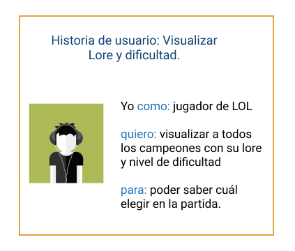

Para la construcción de las historias de usuario, se consideró las respuestas más representativas de los usuarios entrevistados: 

•	El 53,3% jugaba partidas de tipo Normal
•	El 80% llevaba jugando LoL menos de 1 año
•	El 38.5% tenía mayor interés en buscas estadística de los campeones de LoL
•	El 60% estaba interesado en conocer el Lore de los campeones

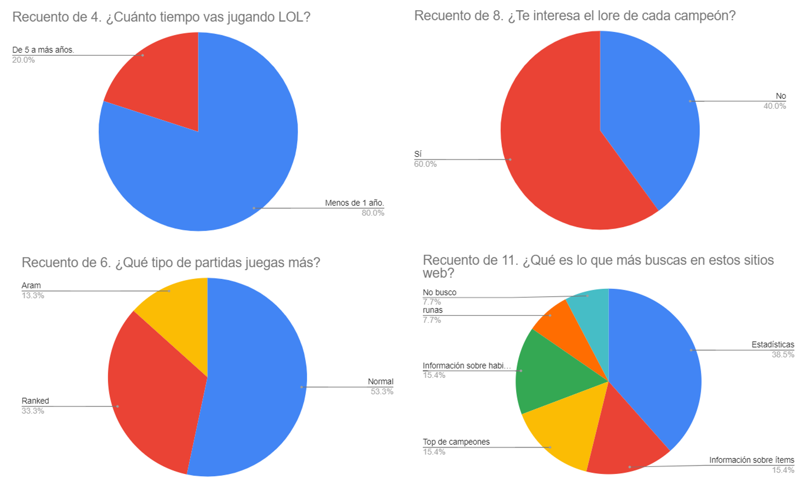

## Problema a solucionar:
Existen demasiadas páginas con gran magintud de data, que puede abrumar al usuario y complicar su búsqueda de algo especifico que quieran encontrar, por eso planteamos crear una interfaz amigable e intuitiva, donde podrá encontrar datos exactos y satisfacer las necesidades del usuario.

## Objetivos:
Teniendo la data, nuestra idea de producto es lograr que el usuario conozca a los campeones de League of Leyends de una forma más práctica y sencilla.
•	Que sea una interfaz amigable e intuitiva para el usuario.
• Los filtros sean intuitivos para el usuario y cumplan sus requerimientos.

## Arquetipo:
Realizamos un arquetipo de un usuario en el cual nos vamos a basar, poniendo sus preferencias y espectativas.
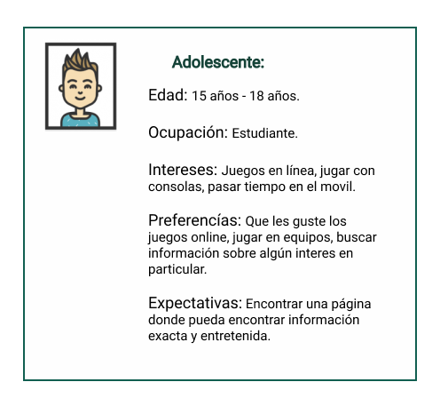

## USERFLOW (Flujo de ususario):
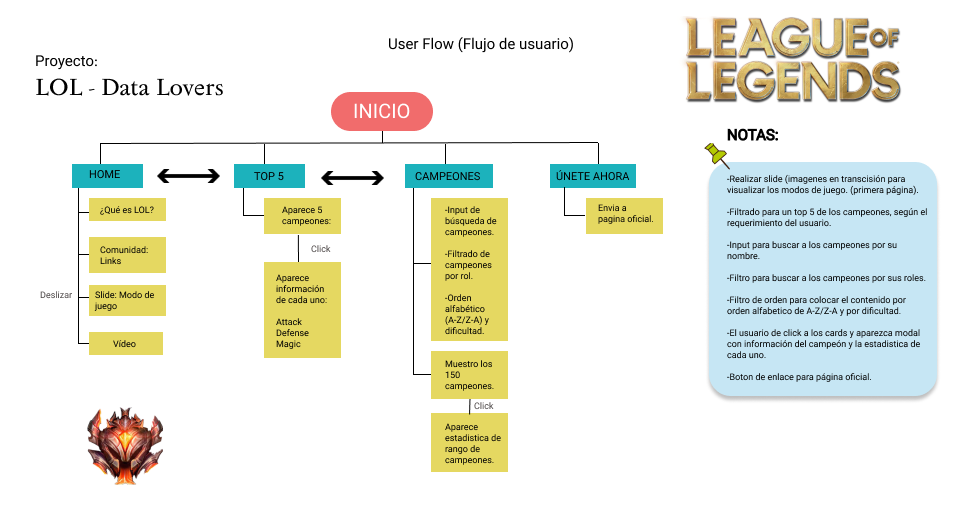

## **Sketch** (Prototipo de baja fidelidad:
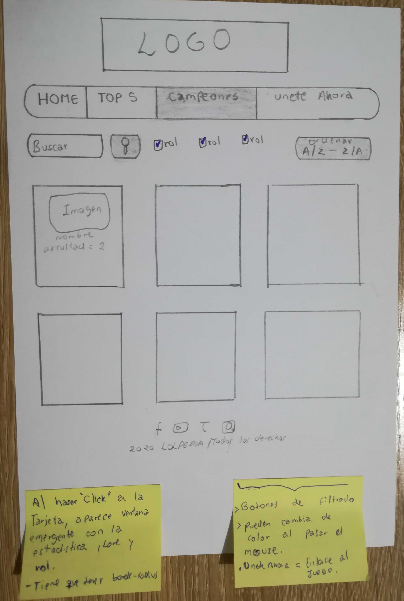 
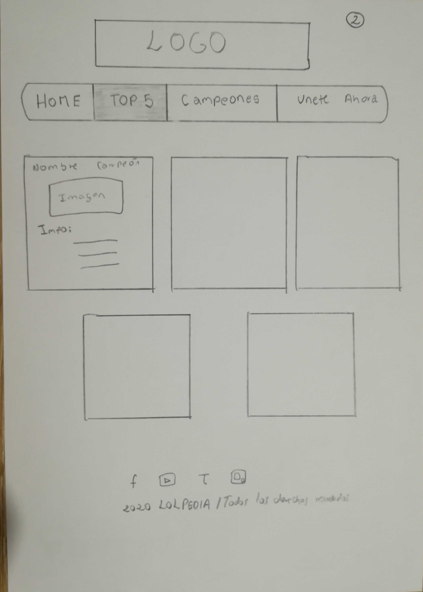
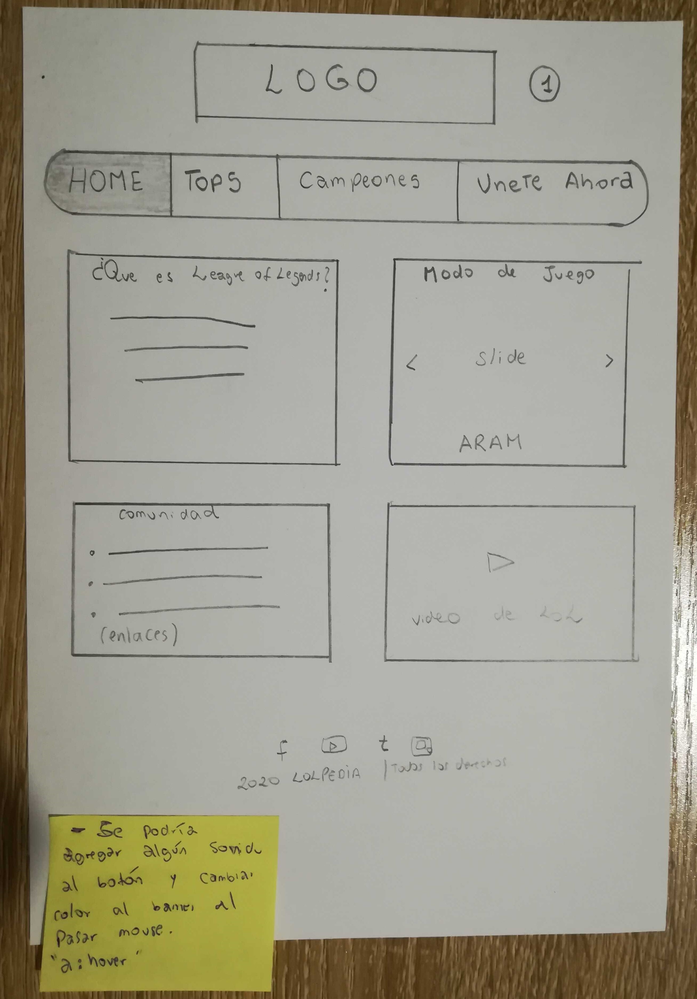

## **Diseño de la Interfaz de Usuario** (Prototipo de alta fidelidad):

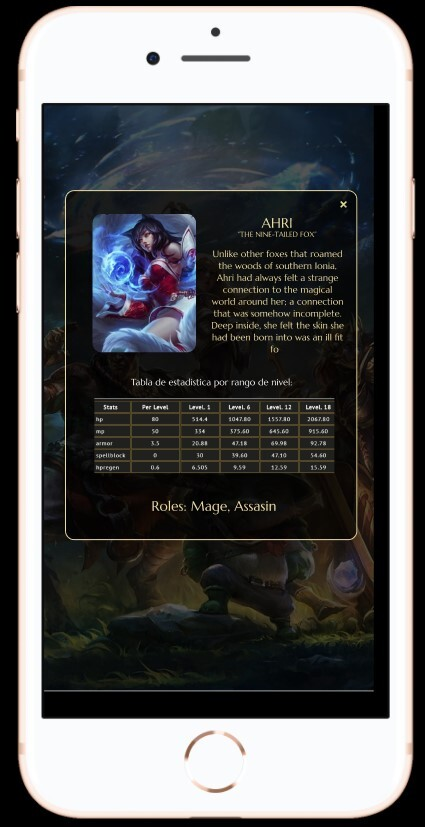
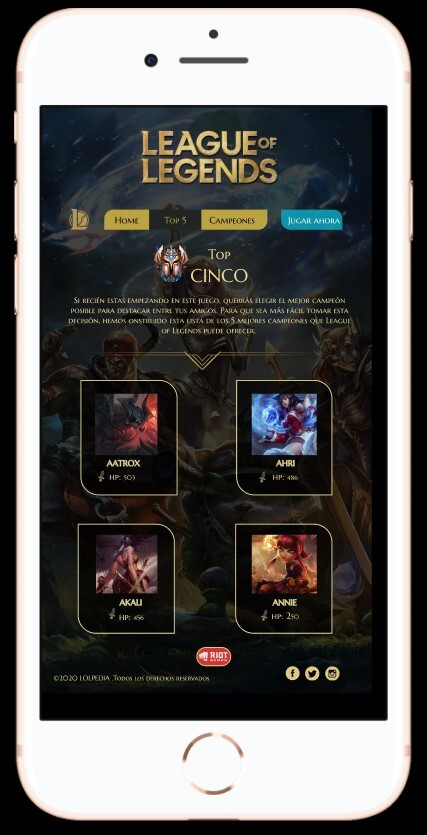
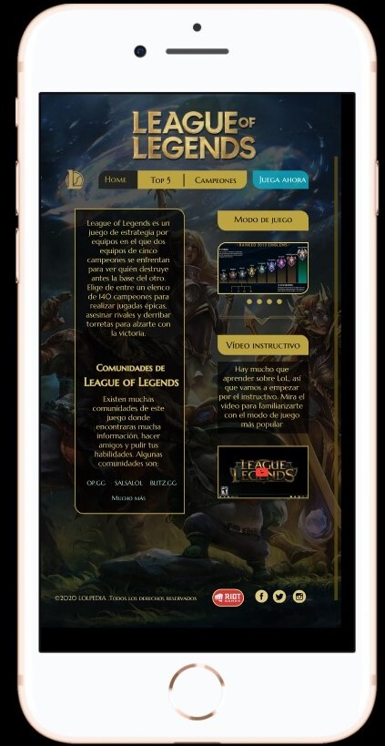
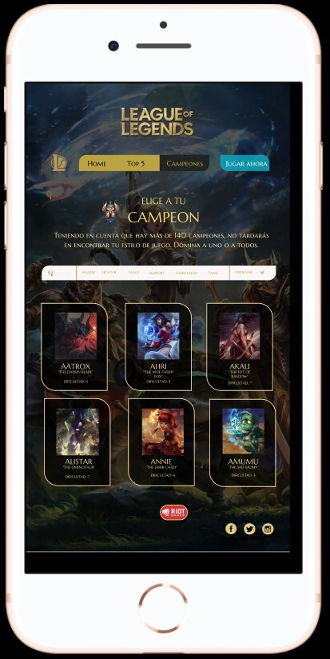

Utilizamos este flujo de usuario con el protitipo creado en Figma para iterar con los usuarios:
:iphone: https://www.figma.com/proto/BW0TVaEPCqrkHV9SC3K2Xb/LOL?node-id=4%3A1&scaling=scale-down

La paleta de colores aplicada fue la siguiente: 

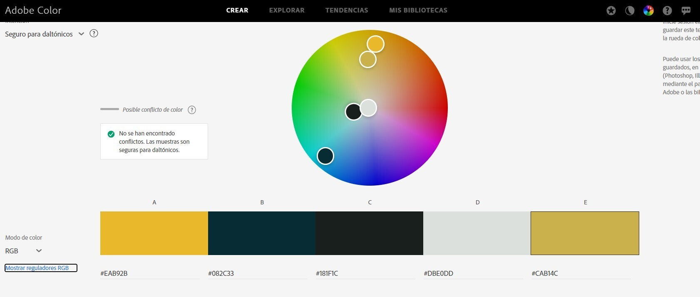

De igual manera, se utilizo la app Zepplin, para organizar los elementos de diseño: 
 (https://zpl.io/a7MXqGR)

## Resultados del test de usabilidad: 
• El flujo fue entendible para los usuarios.
• En la pagina de inicio poner la descripción de LOL, más corta y precisa.
• Colocar el menú con los colores que se relacionen con el juego.
• Colocar los filtros visibles y entendibles.
• Colocar las imagenes de los campeones no tan grandes. 
• Los usuarios sugieren que pongamos un vídeo instructivo sobre el juego.